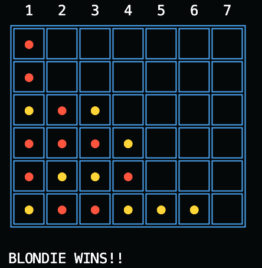

# Evolving a Connect 4 Playing Program

A project on adapting the Blondie24 algorithm to the Connect 4 environment, and comparing it to a modern evolutionary programming approach.

## Background
In 2001, Kumar Chellapilla and David B. Fogel wrote a paper describing an algorithm
that uses the concepts of evolution and natural selection to build a decision network to play
checkers. While going through our own learning of evolutionary computation, we stumbled upon
a similar evolutionary programming algorithm that could accomplish similar tasks, and we
wanted to know to what extent it could compare. The goal was to recreate Blondie24, the
algorithm created by Kumar and David, and compare it to a state-machine-like method in a
similar grid-based game. We were unable to replicate the algorithm, processing power, and time
scale that was necessary for a full and exact comparison to the original algorithm, but we
recreated the original functionality and parameters and compared them on similar contemporary
hardware for training. The results suggest that Blondie is still superior in performance, but
modern evolutionary programming holds up better than expected.

## Other info
This was a collaborative project between Agustin Lorenzo and Logan James for a graduate Evolutionary Computation class at UGA. 
